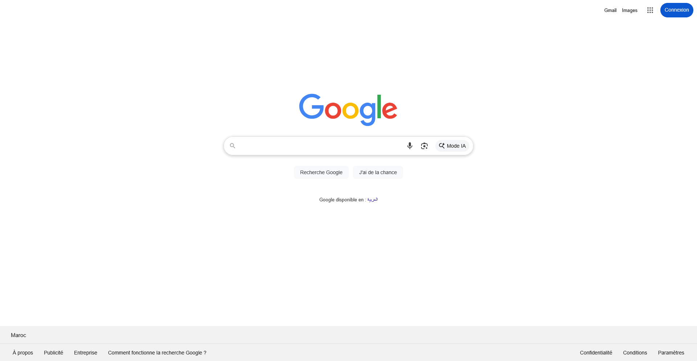
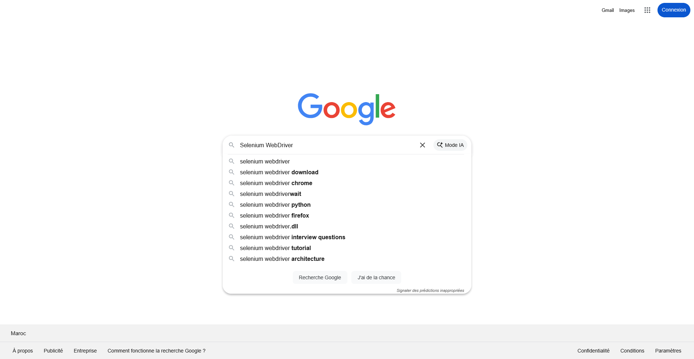
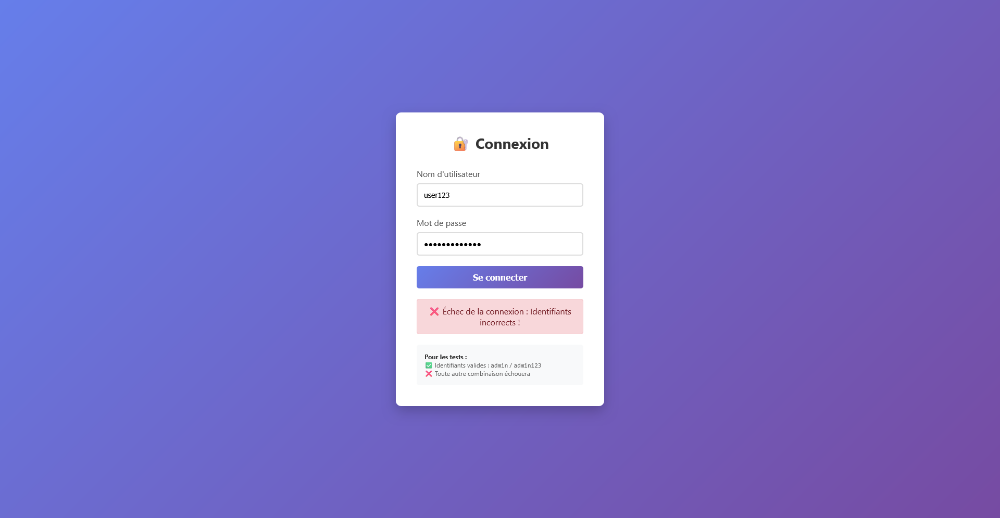

# TP SELENIUM WEBDRIVER 

## 📋 Description du Projet

Ce projet contient 4 exercices complets d'automatisation de tests avec Selenium WebDriver et Firefox (GeckoDriver).

### 🎯 Exercices Implémentés

1. **Exercice 1** : Recherche Google avec acceptation de cookies
2. **Exercice 2** : Test de formulaire de connexion HTML
3. **Exercice 3** : Comparateur de prix Amazon vs eBay
4. **Exercice 4** : Recherche d'entreprises pour stage/PFE

---

## ⚙️ Configuration Requise

### 📌 Prérequis

- **Java 21** (JDK installé)
- **Maven** (gestionnaire de dépendances)
- **Firefox Developer Edition** installé dans : `C:\Program Files\Firefox Developer Edition\firefox.exe`
- **GeckoDriver** téléchargé dans : `C:\Users\ACHRAF\Downloads\geckodriver-v0.36.0-win32\geckodriver.exe`

### 📦 Dépendances Maven

Le fichier `pom.xml` inclut :
- ✅ Selenium WebDriver 4.16.1
- ✅ Selenium Firefox Driver
- ✅ JUnit 5 (pour les tests)
- ✅ WebDriverManager (gestion automatique des drivers)

---

## 🔧 Installation et Configuration

### Étape 1 : Installer GeckoDriver

1. Téléchargez GeckoDriver depuis : https://github.com/mozilla/geckodriver/releases
2. Extrayez `geckodriver.exe` dans un dossier (ex: `C:\Users\ACHRAF\Downloads\geckodriver-v0.36.0-win32\`)
3. **Optionnel** : Ajoutez le chemin de geckodriver à la variable d'environnement PATH

**Note** : Les exercices utilisent déjà le chemin absolu dans le code, donc l'ajout au PATH n'est pas obligatoire.

### Étape 2 : Installer les dépendances Maven

Ouvrez un terminal dans le dossier du projet et exécutez :

```bash
mvn clean install
```

Cette commande télécharge toutes les dépendances nécessaires.

---

## 🚀 Exécution des Exercices

### ▶️ Exercice 1 : Recherche Google

**Classe de test** : `Exercice1_RechercheGoogleTest.java`

**Exécution avec Maven** :
```bash
mvn test -Dtest=Exercice1_RechercheGoogleTest
```

**Exécution avec JUnit dans l'IDE** :
- Ouvrez le fichier dans IntelliJ/Eclipse
- Clic droit → Run Test

**Ce que fait le test** :
1. ✅ Ouvre Firefox et accède à Google
2. ✅ Accepte les cookies automatiquement
3. ✅ Saisit "Selenium WebDriver Firefox" dans la barre de recherche
4. ✅ Soumet la recherche (touche Entrée)
5. ✅ Vérifie que les résultats s'affichent
6. ✅ Affiche les statistiques de résultats

---

### ▶️ Exercice 2 : Test de Formulaire

**Fichier HTML** : `src/main/resources/connexion.html`  
**Classes de test** : `Exercice2_TestFormulaireTest.java`

**Exécution avec Maven** :
```bash
mvn test -Dtest=Exercice2_TestFormulaireTest
```

**Ce que contient le formulaire** :
- Champs : `username` et `password`
- Identifiants valides : `admin` / `admin123`
- Message de succès en vert ou d'erreur en rouge

**Tests implémentés** :
1. ✅ Test avec identifiants valides → Vérifie le message de succès
2. ✅ Test avec identifiants invalides → Vérifie le message d'erreur
3. ✅ Test de validation des champs obligatoires

**Pour tester manuellement le formulaire** :
Ouvrez le fichier dans un navigateur : `file:///C:/Users/ACHRAF/Desktop/TP SEL WEBDRIVER/src/main/resources/connexion.html`

---

### ▶️ Exercice 3 : Comparateur de Prix

**Classe principale** : `Exercice3_ComparateurPrix.java`

**Exécution** :
```bash
mvn exec:java -Dexec.mainClass="com.example.exercices.Exercice3_ComparateurPrix"
```

**Ou via votre IDE** :
- Ouvrez le fichier
- Clic droit → Run main()

**Ce que fait le programme** :
1. ✅ Recherche "iPhone 13" sur Amazon.fr
2. ✅ Accepte les cookies
3. ✅ Récupère le prix du premier résultat
4. ✅ Recherche le même produit sur eBay.fr
5. ✅ Récupère le prix du premier résultat
6. ✅ Compare les prix et affiche le site le moins cher
7. ✅ Utilise des **Explicit Waits** pour gérer le chargement

**Personnalisation** :
Modifiez la variable `produit` dans la méthode `main()` :
```java
String produit = "iPhone 13"; // Changez ici
```

---

### ▶️ Exercice 4 : Recherche d'Entreprises pour PFE

**Classe principale** : `Exercice4_RechercheEntreprises.java`

**Exécution** :
```bash
mvn exec:java -Dexec.mainClass="com.example.exercices.Exercice4_RechercheEntreprises"
```

**Ce que fait le programme** :
1. ✅ Recherche des entreprises sur PagesJaunes.fr
2. ✅ Filtre par secteur (ex: "Développement informatique")
3. ✅ Filtre par ville (ex: "Paris")
4. ✅ Extrait : nom, adresse, téléphone de chaque entreprise
5. ✅ Affiche les résultats dans la console
6. ✅ Sauvegarde les résultats dans un fichier `.txt` horodaté

**Personnalisation** :
Modifiez les paramètres dans la méthode `main()` :
```java
String secteur = "Développement informatique"; // Changez ici
String ville = "Paris"; // Changez ici
```

**Fichier de sortie** :
Le programme crée un fichier `entreprises_YYYY-MM-DD_HH-mm-ss.txt` avec tous les résultats.

---

## ✅ Résultats d'Exécution des Tests

Les tests ont été exécutés avec succès le **09/12/2025**. Voici le résumé des résultats :

### Exercice 1 : Recherche Google
| Test | Description | Statut |
|------|-------------|--------|
| `testRechercheGoogle` | Test d'accès à Google et recherche "Selenium WebDriver" | ✅ Passé |
| `testResultatsNonVides` | Vérification des résultats de recherche | ✅ Passé |

### Exercice 2 : Test de Formulaire de Connexion
| Test | Description | Statut |
|------|-------------|--------|
| `testAffichageFormulaire` | Vérification de l'affichage du formulaire | ✅ Passé |
| `testConnexionValide` | Connexion avec identifiants valides (admin/admin123) | ✅ Passé |
| `testConnexionInvalide` | Connexion avec identifiants invalides | ✅ Passé |
| `testChampsVides` | Validation des champs vides | ✅ Passé |

**Total : 6 tests, 6 passés, 0 échecs**

### Commande d'exécution
```bash
mvn clean test
```

---

## 📸 Captures d'Écran des Tests

Les captures d'écran ci-dessous ont été générées automatiquement lors de l'exécution des tests Selenium.

### 🔍 Exercice 1 : Recherche Google

#### 1.1 Page d'accueil Google

*Accès initial à la page Google avec gestion automatique des cookies.*

#### 1.2 Saisie de la recherche

*Saisie du terme "Selenium WebDriver" dans la barre de recherche.*


---

### 📝 Exercice 2 : Test de Formulaire de Connexion

#### 2.1 Formulaire vide

*Affichage initial du formulaire de connexion avec les champs vides.*

#### 2.2 Formulaire rempli (identifiants valides)

*Champs remplis avec les identifiants valides : admin / admin123*

#### 2.3 Connexion réussie

*Message de succès affiché après une connexion avec des identifiants valides.*

#### 2.4 Formulaire rempli (identifiants invalides)

*Champs remplis avec des identifiants invalides pour tester la gestion d'erreur.*

#### 2.5 Connexion échouée

*Message d'erreur affiché après une tentative de connexion avec des identifiants invalides.*

#### 2.6 Formulaire avec champs vides

*Test de validation avec les champs laissés vides.*

#### 2.7 Validation des champs vides

*Comportement du formulaire après tentative de soumission avec des champs vides.*

---

## 📂 Structure du Projet

```
TP SEL WEBDRIVER/
├── pom.xml                          # Configuration Maven
├── README.md                        # Ce fichier
├── screenshots/                     # Captures d'écran des tests
│   ├── 01_google_homepage.png
│   ├── 02_google_search_input.png
│   ├── 03_google_search_results.png
│   ├── 04_google_results_verification.png
│   ├── 05_formulaire_connexion_vide.png
│   ├── 06_formulaire_rempli_valide.png
│   ├── 07_connexion_reussie.png
│   ├── 08_formulaire_rempli_invalide.png
│   ├── 09_connexion_echouee.png
│   ├── 10_formulaire_champs_vides.png
│   └── 11_validation_champs_vides.png
├── src/
│   ├── main/
│   │   ├── java/
│   │   │   └── com/example/
│   │   │       └── exercices/
│   │   │           ├── Exercice3_ComparateurPrix.java
│   │   │           └── Exercice4_RechercheEntreprises.java
│   │   └── resources/
│   │       └── connexion.html       # Page de connexion pour l'exercice 2
│   └── test/
│       └── java/
│           └── com/example/
│               └── exercices/
│                   ├── Exercice1_RechercheGoogleTest.java
│                   └── Exercice2_TestFormulaireTest.java
```

---

## 🛠️ Explications Techniques

### 🔥 Configuration Firefox

Chaque exercice utilise cette configuration :

```java
System.setProperty("webdriver.gecko.driver", 
    "C:\\Users\\ACHRAF\\Downloads\\geckodriver-v0.36.0-win32\\geckodriver.exe");

FirefoxOptions options = new FirefoxOptions();
options.setBinary("C:\\Program Files\\Firefox Developer Edition\\firefox.exe");

WebDriver driver = new FirefoxDriver(options);
```

**Pourquoi ?**
- `System.setProperty` : Indique où se trouve geckodriver
- `FirefoxOptions` : Configure Firefox Developer Edition
- `WebDriver` : Interface pour contrôler le navigateur

### ⏱️ Explicit Waits (Attentes Explicites)

Utilisées dans tous les exercices pour gérer le chargement dynamique :

```java
WebDriverWait wait = new WebDriverWait(driver, Duration.ofSeconds(10));
WebElement element = wait.until(ExpectedConditions.presenceOfElementLocated(By.id("monId")));
```


